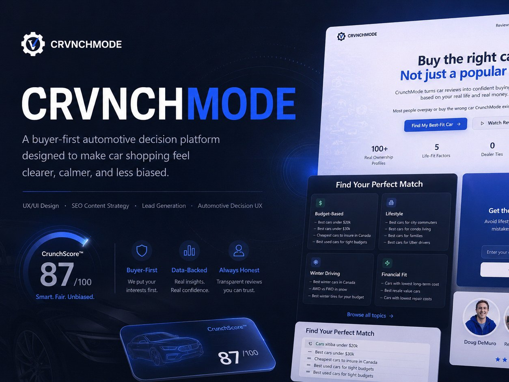

# CRVNCHMODE

**A buyer-first car shopping experience: a guided quiz and an explainable score that match a car to someone's budget and life.**

[**Live prototype**](https://crunchmode.vercel.app/) · [**Case study**](https://www.szn4.design/crvnchmode-designing-a-smarter-way-to-choose-a-car/)



## The problem

Researching a car means jumping between YouTube reviews, dealer listings, insurance quotes, forums and budget calculators. People aren't just asking *"Is this a good car?"* They're asking *"Is this a good car **for my life**?"*

## What it does

- **Smart Buyer Quiz:** ten short questions about budget, driving, winter needs and how long you'll own the car, returning three best-fit matches instead of thirty
- **CrunchScore:** every recommendation is broken into five visible pillars (financial reality, reliability, lifestyle fit, usage fit and resale strength), so buyers can see *why* a car ranks where it does
- **Red flags up front:** each match lists its downsides next to its strengths
- **Ownership reality:** typical monthly cost including fuel, insurance and maintenance
- **Intent-based content:** guides like "Best winter cars in Canada" that lead into the quiz
- **Lead capture after value:** the email ask only appears once the buyer has a shortlist

## Built with

React 18 · TypeScript · Vite · Tailwind CSS · shadcn/ui (Radix) · React Router · TanStack Query

Designed in Figma, built with AI-assisted development (Lovable and Claude), and deployed on Vercel.

## Run it locally

Requires Node.js 18 or newer.

```bash
npm install
npm run dev
```

Then open the local URL Vite prints (usually http://localhost:8080).

| Script | What it does |
|---|---|
| `npm run dev` | Start the dev server |
| `npm run build` | Production build to `dist/` |
| `npm run preview` | Preview the production build |
| `npm run lint` | Lint the project |

## Project structure

```
src/
  pages/        Index (home), Quiz, Reviews, Blog, BlogPost
  components/   HeroSection, CrunchScore, QuickFitSummary, OwnershipReality,
                TopicClusters, LeadGenSection, quiz/ …
  components/ui shadcn/ui primitives
```

## Notes

Concept study and portfolio piece. Scores, prices, vehicle data and reviews are **mock data** that illustrate the experience. They are not real ratings or measured results.

---

Designed and built by **Sabrina Mohammed** · [szn4.design](https://www.szn4.design/) · [LinkedIn](https://www.linkedin.com/in/sabrina-mohammed-31694483/)
